# nlp技术点汇总
## 词向量
### one-hot
### tf-idf
### word2vector
cbow&skip-gram计算流程
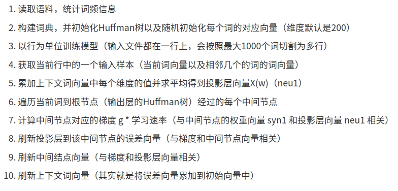
### fasttext
属于文本分类任务，包含两类gram:  
- word-n-gram：词序关系  
- char-n-grams：对低频和oov词友好
---
## BERT类语言模型
### elmo
每一个词会给出3个embedding，这3个embedding可以看作是一个词的3个embedding特征，对3个embedding特征会添加三个位置，对于不同的任务会赋予不同的权重，最后根据权重把这三个embedding结合起来做向量平均，把合并后的embedding作为最后词的embedding  
- 优点  
1.使得word embeding根据输入句子不同而动态变化，解决一词多义问题；
2.采用双向LSTM语言模型来捕获句子更长的依赖关系，提高了模型最终效果；
3.简单易上手，ELMo官方allenNLP发布了相关基于PyTorch实现的版本；
- 缺点  
1.双向LSTM对语言模型建模不如注意力模型，训练速度较慢；
2.双向语言模型是采用拼接的方式得到的，特征选择和融合较弱；
3.当数据数量较大和质量较高时，该模型的良好效果不显著;
### Transformer
参考资料：  
- https://jalammar.github.io/illustrated-transformer/
- http://nlp.seas.harvard.edu/2018/04/03/attention.html  

关键计算流程  
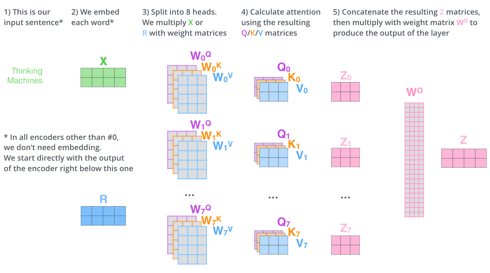
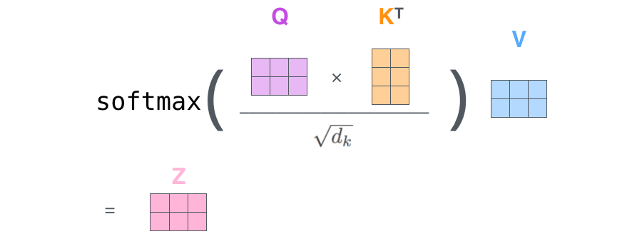
### bert
下游应用方式
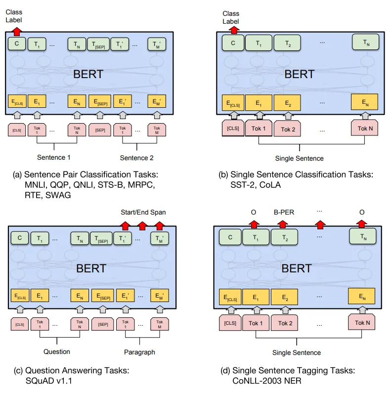
### ernie
#### ernie1.0
- 将语言知识分成了三个类别：单词级别(Basic-Level)、短语级别(Phrase-Level) 和 实体级别(Entity-Level)。通过对这三个级别的对象进行Masking（遮挡），使模型能够学习到语言知识中的语法知识和语义知识。  
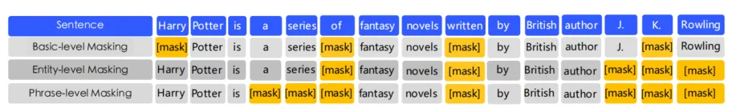
- 引入DLM(Dialogue Language Model)任务
- 使用中文wiki百科（句子数21M），百度百科（51M），百度新闻（47M），百度贴吧（54M）百度百科，百度知道，百度新闻等训练数据
#### ernie2.0
提出了支持continual multi-task learning的ERNIE framework  
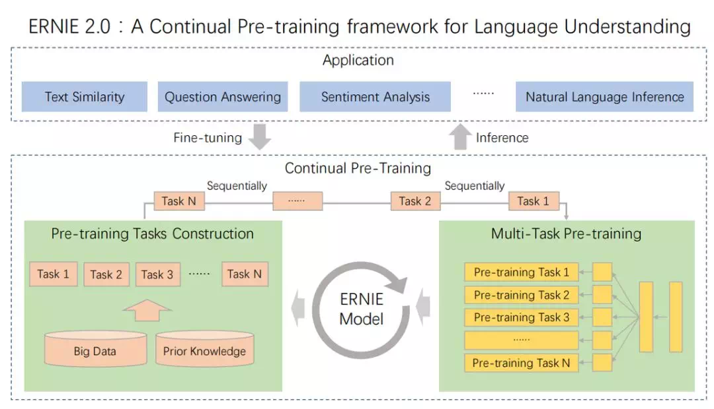
多种层次预训练任务
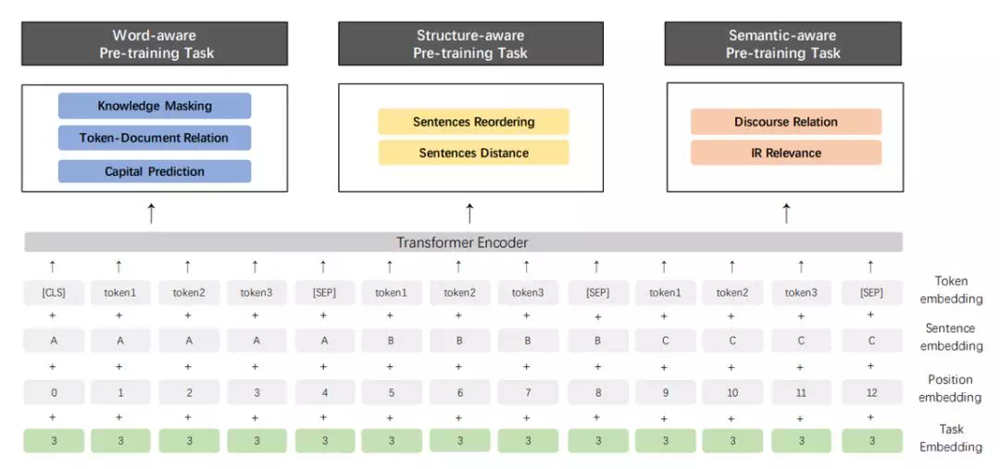
注意：增加了task embedding来表示不同的任务类型
### RoBerta
- 扩大模型
  - 更大的模型参数量
  - 更大bacth size
  - 更多的训练数据
    - CC-NEWS等在内的160GB纯文本(最初的BERT使用16GBBookCorpus数据集和英语维基百科进行训练)
- 模型优化
  - 去掉下一句预测(NSP)任务
  - 动态掩码
    - 每次向模型输入一个序列时都会生成新的掩码模式。这样，在大量数据不断输入的过程中，模型会逐渐适应不同的掩码策略，学习不同的语言表征
  - 文本编码(Byte-Pair Encoding（BPE）)
    - 基于 char-level ：原始 BERT 的方式，它通过对输入文本进行启发式的词干化之后处理得到。
    - 基于 bytes-level：与 char-level 的区别在于bytes-level 使用 bytes 而不是 unicode 字符作为 sub-word 的基本单位，因此可以编码任何输入文本而不会引入 UNKOWN 标记。
    - 词表大小从3万（原始 BERT 的 char-level ）增加到5万。这分别为 BERT-base和 BERT-large增加了1500万和2000万额外的参数，这种统一编码的优势会超过性能的轻微下降
### ALBert(A Lite Bert)
总结：  
1. 对嵌入矩阵分解，解除词嵌入和隐含层大小的关系，便于隐含层大小的扩展而不剧增模型参数  
2. 跨层参数共享，虽然一定程度上微微降低性能，但是可以大大地降低模型参数，收益很高  
3. 放弃NSP，引入SOP，更为有力地学习句子间的连贯性  

具体来说
- 模型精简
  - factorized embedding parameterization（词嵌入的因式分解）
    - wordPiece embedding是学习上下文独立的表征维度为E，而隐藏层embedding是学习上下文相关的表征维度为H，为了应用的方便，原始的bert的向量维度E=H，这样一旦增加了H，E也就增大了。
    - 词汇量大小是V，向量维度是E，隐藏层向量为H，则原始词汇向量参数大小为V * H，ALBert将原始embedding映射到V * E（低纬度的向量），然后映射到隐藏空间H，这样参数量从V*H下降到V * E+E * H，参数量大大下降。
  - cross-layer parameter sharing（交叉层的参数共享）：这一技术可以避免参数量随着网络深度的增加而增加。
    - base的bert总共由12层的transformer的encoder部分组成，层参数共享方法避免了随着深度的加深带来的参数量的增大。具体的共享参数有这几种，attention参数共享、ffn残差网络参数共享
- 增加句子顺序预测（SOP，sentence-order prediction）  
  - SOP正样本也是从原始语料中获得，负样本是原始语料的句子A和句子B交换顺序
### TinyBert
Bert-config文件例子
```
{
  "hidden_size": 384,                   #决定token被编码的长度，即特征长度
  "intermediate_size": 1536,            # MLP第一次映射的长度，这里特征长度乘以4
  "max_position_embeddings": 512,       # 最大输入长度。
  "model_type": "tiny_bert",                
  "num_attention_heads": 12,            # 注意力头个数
  "num_hidden_layers": 4,               # 堆叠多少层
  "vocab_size": 30522                   # 训练词典个数，与训练语料有关
}
{
  "hidden_size": 768,           
  "intermediate_size": 3072,
  "max_position_embeddings": 512,
  "model_type": "bert",
  "num_attention_heads": 12,
  "num_hidden_layers": 12,
  "vocab_size": 30522
}
```
蒸馏流程
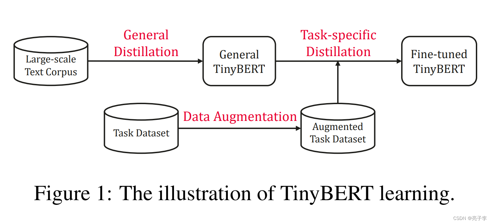
蒸馏loss的类型
- Embedding-layer distillation
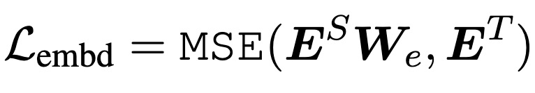
  - Student的embedding层的特征维度和Teacher是不一样的，因此要乘上一个转换的映射矩阵，此矩阵在训练时学习
- Hidden states based distillation
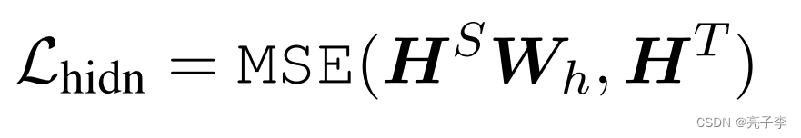
- Attention based distillation
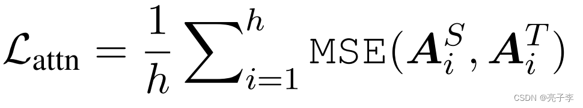
- Prediction-layer distillation
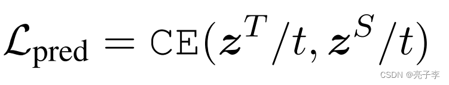

### xlnet
TODO
### T5（Text-to-Text Transfer Transformer）
采用Transformer的encoder-decoder架构
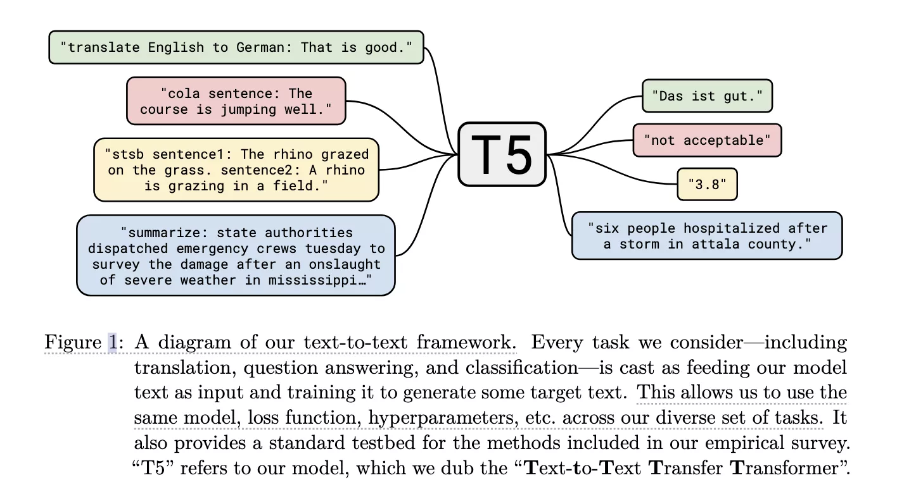
注意：这里回归任务对应的浮点数会被转成字符串看待，从而可以token by token的预测出来。  
  
在下游任务上fine-tune模型时，为了告诉模型当前要做何种任务，我们会给每条输入样本加一个与具体任务相关的前缀，例如：
  - 翻译前缀： translate English to German:
  - 分类前缀： cola sentence:
  - 摘要前缀： summarize:
### ELECTRA
- 网络结构
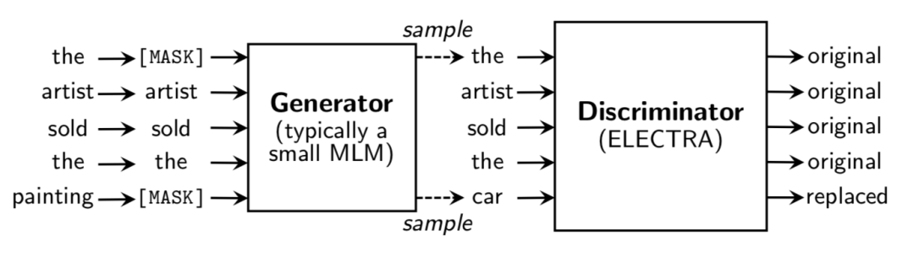
Generator和Discriminator可以看作两个BERT，生成器的任务是MLM，判别器的任务是Replaced Token Detection，判断哪个字被替换过(判断每个token是真是假)。


- 对比GAN的区别
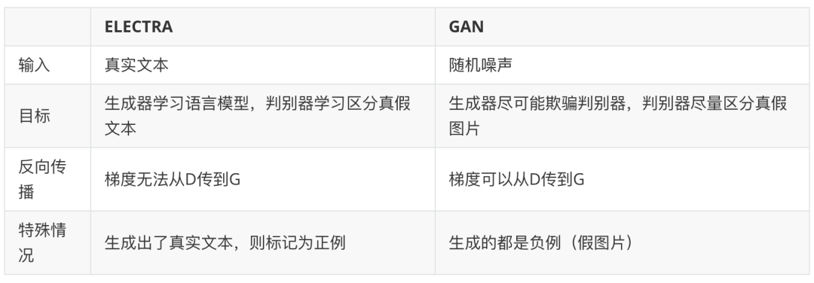

---
## GPT类语言模型
### gpt
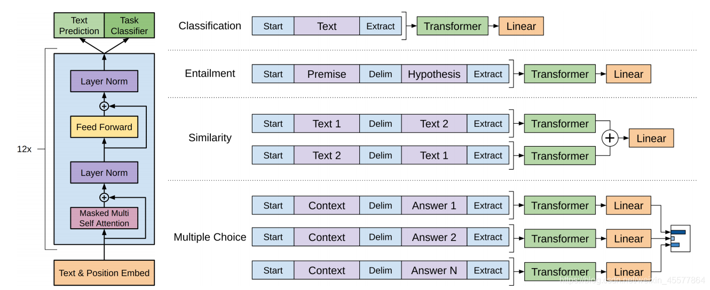
### chatgpt
参考资料：  
https://blog.csdn.net/Kaiyuan_sjtu/article/details/128663147?spm=1001.2014.3001.5501  

---
## 经典NN模型
### TextCNN
### RNN/LSTM
### seq2seq
参考资料  
https://zhuanlan.zhihu.com/p/37601161

### attention
### ABCNN
---
## 多模融合模型
参考资料：  
https://baijiahao.baidu.com/s?id=1760849279374584602&wfr=spider&for=pc  
https://zhuanlan.zhihu.com/p/539906825
### 多域DNN
### CLIP
### METER: A Multimodal End-to-end TransformER Framework
### 多流交互模型
#### LXMERT
#### VILBERT
### 单流交互模型
#### Unicoder-VL
#### VIsualBERT
### 多模态GPT
#### DaLL E2
#### Stable Diffusion
---
## 多任务模型
### mttbert
### prompt
### CoT,Chain of Thought
---
## 参考资料
https://zhuanlan.zhihu.com/p/54743941  
https://zhuanlan.zhihu.com/p/49271699  
https://zhuanlan.zhihu.com/p/254821426  
https://zhuanlan.zhihu.com/p/597586623

